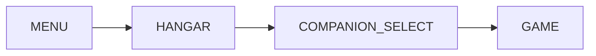
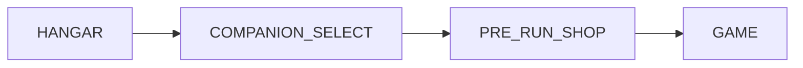

# Scrap Economy & Pre-Run Shop — SpaceHero Design Spec

**Status:** Design (Phase 1 MVP)  
**Audience:** Implementation in `geminigameV3.0`  
**Last aligned with codebase:** May 2026

---

## 1. Executive summary

Artifacts move to **gameplay-only unlocks** (drops, bosses, milestones). **Meta scrap** (`localStorage` via `lib/metaStore.ts`) becomes the primary between-run currency, spent in a **pre-run loadout shop** between companion selection and survival start.

Goals:

- Meaningful scrap grind without mandatory purchases
- Run-to-run agency (build a “loadout plan” before launch)
- Power ceiling ~20–40% from shop combined; skill + artifact RNG still decide wins
- Reuse existing scrap earn/bank pipeline with tuned rates

**Recommendation:** Scrap-only for Phase 1. **Essence** (boss-only second currency) deferred to Phase 3.

---

## 2. Current state (codebase audit)

### 2.1 What exists today

| System | Location | Behavior |
|--------|----------|----------|
| Meta scrap wallet | `src/lib/metaStore.ts` | `getMetaScrap`, `addMetaScrap`, `spendMetaScrap` |
| In-run scrap tally | `GameState.runScrapEarned` | Earned during run, not spent mid-run except events |
| Banking on death | `App.tsx` ~829 | `banked = runScrapEarned + computeRunEndScrap` → `addMetaScrap` |
| Kill drops | `scrapFromKill` in `balance/scrapRewards.ts` | 12% chance, ~1 scrap (trait multipliers) |
| Stage clear | `computeStageClearScrap(stage)` | `8 + stage * 4` |
| Boss bonus | `computeBossScrapBonus(stage)` | `15 + stage * 5` (+ salvage passive in App) |
| Run end bonus | `computeRunEndScrap` | `stage*10 + score/1000`, trait mult |
| Hangar display | `HangarScreen`, `GearSystem`, `RunSummary` | Shows meta scrap total |
| Artifact scrap unlock | `HangarScreen` → `onUnlockWithScrap`, `Artifact.scrapCost` in `content/artifacts.ts` | **To deprecate for vault purchases** |

### 2.2 Launch flow (survival)



**Insertion point for shop:**



- New screen: `PRE_RUN_SHOP` (or `LOADOUT_SHOP`)
- `CompanionSelectScreen.onConfirm` → navigate to shop, not `startGame` directly
- Shop confirm → `startGame(shipId, companionId, purchasedShopIds)`

### 2.3 Threat model (shop Category C)

- `computeThreatLevel` in `balance/threat.ts`: 0–100 from passives, stage, exclusives
- `getThreatMult`: spawn/difficulty scaling ~0.75–2.25
- Shop threat items must modify **initial** threat or **growth rate** via dedicated run flags (see §6), not by hacking passive count

---

## 3. Design principles

1. **Optional spend** — Skip shop = valid; no hard gate.
2. **Additive cart** — Multiple items; total = sum of prices; no duplicate buys of same id per run.
3. **Transparent power** — Each card shows % or flat stat impact; cap combined offensive/defensive shop bonus.
4. **Earn loop unchanged in feel** — Runs still bank scrap; shop spends **before** run at risk.
5. **Artifacts stay aspirational** — Rare drops/bosses; shop does not sell artifact slots in Phase 1.

---

## 4. Economy model

### 4.1 Baseline earn rates (current formulas)

Approximate scrap per **decent run** (Stage 3 clear, ~200 kills, score ~80k):

| Source | Estimate |
|--------|----------|
| Kills (12% × ~1) | 20–35 |
| Stage clears (1+2+3) | 8+12+16 = 36 |
| Boss(es) | 25–40 |
| Run end | 30 + 80 = ~110 |
| **Total** | **~150–220** before traits |

With `scavenger` (+50%): **~225–330**.

**Whale build (~1000 scrap):** ~4–7 strong runs or ~8–12 average runs — matches target “5–10 Stage 3+ runs.”

### 4.2 Proposed tuning (Phase 1)

Keep formulas; add **shop sink** so inflation does not trivialize difficulty:

| Knob | Current | Proposed |
|------|---------|----------|
| Kill drop chance | 12% | 10–12% (hold) |
| Kill scrap amount | 1 base | 1–2 scaled by `min(stage, 5)` |
| Stage clear | `8+4×stage` | unchanged |
| Boss bonus | `15+5×stage` | +10% if run had shop spend (optional feedback) |
| First-time daily bonus | — | Optional +50 meta (Phase 2) |

**Validation metric:** Median meta scrap after 10 runs ≈ 1,200–1,800; whale cart affordable but not every run.

### 4.3 Player segments

| Segment | Meta scrap | Typical cart |
|---------|------------|----------------|
| New (0–500) | 1–2 small buffs | Fortified + Guardian Angel |
| Mid (500–1,500) | Mix A+B | Overdrive + Swift Training + Calm |
| Veteran (2,000+) | Full combos | Whale build occasionally |

### 4.4 Power budget (hard cap)

Track on `GameState` as `shopPowerBudget` or derive from `activeShopEffects`:

| Stat channel | Per-item max | Combined cap |
|--------------|--------------|--------------|
| Damage mult | +25% | +25% |
| Speed mult | +20% | +20% |
| Max HP flat | +30 | +30 |
| Crit chance | +10% | +10% |
| Regen | +0.5 HP/s | +0.5 HP/s |
| Threat offset | −10 initial | −10 |
| Threat growth | −20% rate | −20% |
| Early loot/XP | special flags | 2 items max from cat B |

Implementation: `clampShopModifiers()` in `shopEffects.ts` after applying all purchased ids.

---

## 5. Shop catalog (Phase 1 MVP)

**Phase 1 ships 10 items:** all of Category A (5) + Category B (4) + one Category D entry OR hold D for Phase 2. Below is the **full catalog** for planning; MVP flag `phase: 1 | 2` on each def.

### 5.1 Category A — Starting buffs

| id | Name | Cost | Effect (run start) | Power note |
|----|------|------|-------------------|------------|
| `shop_overdrive` | Overdrive | 200 | `baseDamage *= 1.20` | +20% dmg |
| `shop_kinetic_surge` | Kinetic Surge | 150 | `player.speed *= 1.15` | +15% speed |
| `shop_fortified` | Fortified | 100 | `maxHealth += 30`, heal same | flat hull |
| `shop_sharpened` | Sharpened | 125 | `critChance += 0.10` | crit |
| `shop_regeneration` | Regeneration | 175 | `regenPerSec += 0.5` | sustain |

### 5.2 Category B — Early stage boosts

| id | Name | Cost | Effect | Duration |
|----|------|------|--------|----------|
| `shop_abundant_ammo` | Abundant Ammo | 250 | Loot drop mult 2× | stages 1–2 |
| `shop_swift_training` | Swift Training | 200 | XP gain +25% | stages 1–2 |
| `shop_lucky_streak` | Lucky Streak | 300 | Next 2 artifact picks min Rare | first 2 artifact events |
| `shop_guardian_angel` | Guardian Angel | 150 | Shield 50 HP, 30s | on spawn |

### 5.3 Category C — Threat management (Phase 2)

| id | Name | Cost | Effect |
|----|------|------|--------|
| `shop_calm_before_storm` | Calm Before Storm | 200 | `threatLevel = max(0, threatLevel - 10)` at run start |
| `shop_breathing_room` | Breathing Room | 250 | `threatGrowthMult *= 0.8` (custom flag) |

**Implementation note:** Threat today is recomputed from passives via `computeThreatLevel`. Shop threat items should set `state.shopThreatOffset` and `state.shopThreatGrowthMult` read inside a thin wrapper or post-process after first compute.

### 5.4 Category D — Companion boosts (Phase 2)

| id | Name | Cost | Effect |
|----|------|------|--------|
| `shop_companion_ascension` | Companion Ascension | 400 | `companionLevel += 1` (cap meta max) |
| `shop_companion_hp` | Companion HP Boost | 150 | `companionRuntime.maxHealth *= 1.5` at spawn |

Requires `activeCompanionId` set in `startGame`; no-op with toast if no companion.

### 5.5 Example builds (from spec)

| Build | Items | Cost |
|-------|-------|------|
| Budget | Overdrive | 200 |
| Mid | Overdrive + Kinetic + Fortified | 475 |
| Whale | + Sharpened + Lucky + Calm | 1,075+ |

---

## 6. Data structures

### 6.1 `src/game/shop/shopTypes.ts`

```ts
export enum ShopCategory {
  STARTING_BUFFS = 'STARTING_BUFFS',
  EARLY_STAGE = 'EARLY_STAGE',
  THREAT = 'THREAT',
  COMPANION = 'COMPANION',
}

export type ShopItemId = string; // union of known ids

export interface ShopItemDef {
  id: ShopItemId;
  name: string;
  description: string;
  category: ShopCategory;
  costScrap: number;
  costEssence?: number; // Phase 3
  icon: string; // lucide name or asset key — no emoji in UI strings
  phase: 1 | 2 | 3;
  stackRule: 'once_per_run';
  tags?: ('damage' | 'speed' | 'defense' | 'economy' | 'threat' | 'companion')[];
}

export interface ShopCartLine {
  itemId: ShopItemId;
  costScrap: number;
}

export interface ShopPurchaseResult {
  ok: boolean;
  error?: 'insufficient_scrap' | 'duplicate_item' | 'invalid_item';
  cart: ShopCartLine[];
  totalScrap: number;
  remainingScrap: number;
}

/** Persisted only for the upcoming run — not meta. */
export interface RunShopLoadout {
  purchasedIds: ShopItemId[];
  totalSpent: number;
}
```

### 6.2 `GameState` extensions (`types.ts`)

```ts
/** Applied at run start from pre-run shop; consumed by shopEffects + systems. */
shopPurchasedIds: ShopItemId[];
shopRunFlags: {
  abundantAmmoStagesLeft?: number;
  swiftTrainingStagesLeft?: number;
  luckyArtifactPicksLeft?: number;
  guardianShieldHp?: number;
  guardianShieldTimer?: number;
  threatOffset?: number;
  threatGrowthMult?: number;
};
```

Do **not** store meta scrap on `GameState`; keep wallet in `metaStore` only.

### 6.3 Persistence

| Key | Store | Content |
|-----|-------|---------|
| `metaScrap` | existing | Wallet balance |
| `preRunShopCart_v1` | optional | Last cart for UX restore (Phase 2) |
| `shopStats_v1` | optional | Total spent, favorite items (analytics) |

Spend happens **on confirm**: `spendMetaScrap(cartTotal)` then `startGame` with ids.

---

## 7. Module layout

```
src/game/shop/
  shopTypes.ts      — enums + interfaces
  shopDefs.ts       — SHOP_ITEMS catalog, getShopItem, byCategory
  shopLogic.ts      — cart add/remove, validate, computeTotal, canAfford
  shopEffects.ts    — applyShopEffects(state, purchasedIds)
  shopLogic.test.ts — cart math, caps, afford checks
  shopEffects.test.ts — stat caps, threat flags

src/components/
  PreRunShop.tsx    — full screen layout
  shop/ShopCard.tsx
  shop/ShopCart.tsx
  shop/ShopCategoryTabs.tsx
```

### 7.1 `shopLogic.ts` responsibilities

- `buildCart(selectedIds: ShopItemId[]): ShopCartLine[]`
- `cartTotalScrap(cart): number`
- `validatePurchase(metaScrap, selectedIds): ShopPurchaseResult`
- `commitPurchase(metaScrap, selectedIds): { ok, newBalance, loadout }` → calls `spendMetaScrap`

### 7.2 `shopEffects.ts` responsibilities

- `applyShopEffects(state: GameState, ids: ShopItemId[]): void` — call from `startGame` after ship/traits/artifacts/companion, before threat compute
- `tickShopRunFlags(state, dt): void` — guardian shield timer, stage counters on stage advance
- Hooks:
  - **Loot:** `lootDropController` checks `abundantAmmoStagesLeft`
  - **XP:** companion/survival XP grants check `swiftTrainingStagesLeft`
  - **Artifacts:** `pickSurvivalCards` / artifact picker honors `luckyArtifactPicksLeft`
  - **Threat:** after `computeThreatLevel`, apply offset; spawn curve uses `threatGrowthMult` if set

### 7.3 Integration checklist

| Step | File | Action |
|------|------|--------|
| 1 | `shopDefs.ts` | Define MVP items |
| 2 | `shopEffects.ts` | Apply + clamp modifiers |
| 3 | `types.ts` | Add `shopPurchasedIds`, `shopRunFlags` |
| 4 | `Logic.ts` / `INITIAL_STATE` | Default empty flags |
| 5 | `App.tsx` | Screen `PRE_RUN_SHOP`, wire companion confirm → shop → startGame |
| 6 | `App.tsx` `startGame` | Accept `shopIds`, call `applyShopEffects` |
| 7 | `HangarScreen` / `RelicVaultTab` | Remove or hide scrap unlock UI; show “Unlock in runs” |
| 8 | `content/artifacts.ts` | Deprecate `scrapCost` for purchase (keep for display/rarity if needed) |
| 9 | `GameHUD.tsx` | Optional: small “Loadout” chip listing active shop buffs |
| 10 | `RunSummary.tsx` | Line: “Shop spend: −450 scrap” |
| 11 | Stage advance hook in `App.tsx` | Decrement `*StagesLeft` counters |

---

## 8. UI specification

### 8.1 Screen: Pre-Run Loadout Shop

**Copy (Swedish UI — match hangar tone):**

- Title: `LASTUTRUSTNINGSBUTIK` or `BUTIK FÖRE RUN`
- Confirm: `BEKRÄFTA OCH STARTA ÖVERLEVNAD`
- Skip: `Hoppa över` (ghost)
- Scrap: `SKROT: {n}`
- Cart: `Totalt: {n}` / `Kvar: {n}`

**Layout (desktop / mobile):**

- Full-screen overlay, same shell as `CompanionSelectScreen` (`SpaceBackground`, safe areas)
- Header: title + scrap counter (24px bold cyan)
- Tabs: `ALLA` | `START` | `TIDIGT` | `HOT` | `DRÖNARE` (map to categories; Phase 1 hide empty tabs)
- Main: CSS grid 1 col mobile / 3 col desktop, scrollable
- Right rail (bottom sheet on mobile): cart summary + confirm

### 8.2 `ShopCard` states

| State | Style |
|-------|--------|
| Default | Dark border, muted text |
| Hover/focus | Cyan border, scale 1.02–1.05 |
| Selected | Cyan fill tint, checkmark |
| Unaffordable | Muted price, not selectable |
| Disabled (owned in cart) | Green glow + check — one per id |

**Accessibility:** `aria-pressed` on toggle; confirm disabled when `remaining < 0`.

### 8.3 Time on screen

Target 30–60s: no timer pressure; single-screen grid avoids deep navigation.

---

## 9. Artifact migration

### 9.1 Remove scrap purchase path

1. `RelicVaultTab`: remove “Unlock for X scrap” button; show unlock source (boss, stage, achievement).
2. `onUnlockWithScrap` prop → remove from `HangarScreen` / `App.tsx`.
3. Keep `unlockedArtifactIds` progression via existing run unlock + meta progress (`metaProgress.ts`).

### 9.2 Optional bridge (one release)

- Players who already unlocked via scrap: no change.
- Locked artifacts: hint “Slåss i överlevnadsläge” instead of scrap price.

---

## 10. Phase roadmap

### Phase 1 — MVP (ship first)

- [ ] 10 shop items (Cat A + B; defer C/D or ship 1 companion item)
- [ ] `shopDefs`, `shopLogic`, `shopEffects` + tests
- [ ] `PreRunShop` UI + screen wiring
- [ ] Meta scrap spend on confirm
- [ ] Hide artifact scrap unlock
- [ ] Desktop playtest + balance pass

**Acceptance:** Complete run loop MENU → HANGAR → COMPANION → SHOP → GAME; cart persists spend; effects visible in HUD/stats.

### Phase 2

- [ ] Category C threat items + threat wrapper
- [ ] Category D companion items
- [ ] Cosmetics (scrap sinks, no combat power)
- [ ] Cart restore / favorites

### Phase 3 — Essence (optional)

| Source | Amount |
|--------|--------|
| Mini-boss | 1 |
| Stage boss | 2–3 |
| Secret boss | 5 |

Hybrid items:

- `shop_lucky_streak`: 1 Essence + 100 scrap (alt pricing)
- `shop_companion_ascension`: 2 Essence

Separate wallet: `metaEssence` in `metaStore.ts`; UI shows both counters.

### Phase 4 — Polish

- Consumables (revival token — run-long or meta)
- Seasonal rotation subset of `SHOP_ITEMS`
- QoL free items (recap, extended hangar timer)

---

## 11. Balance & playtest protocol

### 11.1 Metrics to log (local/dev)

- `metaScrap` before/after run
- Cart total on start
- Stage reached, time survived
- Threat peak, artifacts found

### 11.2 Tuning targets

| Question | Target answer |
|----------|----------------|
| Can new player afford 100-scrap item run 2? | Yes |
| Does whale build trivialize Stage 1–2? | No — still die to mistakes |
| Win rate +40% shop vs no shop | ≤15% relative increase at same skill |
| % players skipping shop | 20–40% OK |

### 11.3 A/B knobs

- Item costs ±15%
- Kill scrap chance 10% vs 12%
- Combined power cap 35% vs 40%

---

## 12. Risks & mitigations

| Risk | Mitigation |
|------|------------|
| Shop required to progress | All items optional; base balance without shop |
| Stacking breaks economy | `once_per_run` + hard caps in `shopEffects` |
| Threat items ineffective | Dedicated flags, test with `computeThreatLevel` snapshots |
| Companion items wasted | Disable card or warn if no companion selected |
| Pay-to-win perception | Shop is earned currency only; no IAP in spec |
| UI friction | Skip button, remember last tab (Phase 2) |

---

## 13. Open questions (decide before Phase 1 code)

1. **Swedish vs English** shop strings — hangar uses English headers today; confirm product language.
2. **Refund on back** from shop to companion select — cart cleared or preserved?
3. **Rails / Campaign modes** — shop only for NORMAL survival or all modes?
4. **Lucky Streak** vs existing `postBossBuffPick` — stack rules?
5. **Regeneration** stack with healer companion — additive with cap?

---

## 14. Implementation order (suggested PR sequence)

1. `shopTypes` + `shopDefs` (data only) + unit tests for cart math  
2. `GameState` fields + `applyShopEffects` + tests  
3. `PreRunShop` UI (mock data)  
4. `App.tsx` screen + `startGame` hookup  
5. Gameplay hooks (loot, XP, artifact picker, stage counters)  
6. Remove artifact scrap unlock + copy pass  
7. Balance pass on `scrapRewards.ts` if earn outpaces sinks  

---

## 15. Appendix — file reference map

| Concern | Path |
|---------|------|
| Meta wallet | `src/lib/metaStore.ts` |
| Scrap formulas | `src/game/balance/scrapRewards.ts` |
| Banking | `src/App.tsx` (game over handler) |
| Threat | `src/game/balance/threat.ts` |
| Run init | `src/App.tsx` `startGame`, `src/game/Logic.ts` `INITIAL_STATE` |
| Companion loadout | `src/game/companions/companionLeveling.ts` `applyCompanionLoadout` |
| Artifacts | `src/game/content/artifacts.ts`, `applyArtifactStats.ts` |
| Hangar | `src/game/controls/HangarScreen.tsx`, `hangar/RelicVaultTab.tsx` |

---

*This document is the single source of truth for the scrap economy redesign until Phase 1 ships. Update §4.2 earn table after playtest telemetry.*
