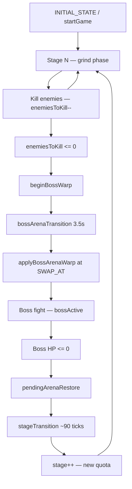

# Survival Mode — State Flow

Reference for the **stage-based survival loop** (kill quota → boss warp → boss fight → restore → next stage).

> **Naming note:** The main menu run sets `gameMode: 'NORMAL'` in `App.tsx` (`startGame`). The type `SURVIVAL` exists but only tweaks spawn `levelProgress` (time ramp); boss/stage logic is gated on **`NORMAL`**, not `SURVIVAL`. This doc describes the **NORMAL survival loop** unless stated otherwise.

---

## High-level lifecycle



---

## Phase 1 — Run start (`INITIAL_STATE` + `startGame`)

| Source | What happens |
|--------|----------------|
| `Logic.ts` → `INITIAL_STATE()` | Base `GameState`: `stage: 1`, `enemiesToKill: 50`, all boss flags off, `gameMode: 'NORMAL'`, `cardTimer: 0` |
| `App.tsx` → `startGame()` | Overrides: `cardTimer: 15`, `spawnRampTimer: 5`, `threatLevel` computed, `gameMode: 'NORMAL'`, clears rails/campaign |

**Entry conditions for spawning:** `stageTransition <= 0`, `bossArenaTransition <= 0`, not `ON_RAILS`.

---

## Phase 2 — Stage grind (kill quota)

### Core flags

| Flag | Meaning | Set / cleared |
|------|---------|----------------|
| `enemiesToKill` | Remaining kills before boss warp | Init: `getStageQuota(stage)` (50 stage 1). Decrement on enemy kill. Reset on stage advance |
| `bossActive` | Boss phase (arena or overworld boss entity) | `false` during grind. See warp/boss sections |
| `bossArenaTransition` | Warp cinematic timer (seconds) | `0` during grind |
| `stageTransition` | Post-boss interstitial (frame-normalized ticks) | `0` during grind |
| `pendingArenaRestore` | Restore overworld snapshot after boss | `false` during grind |
| `inBossArena` | Player in shrunk boss arena world | `false` during grind |
| `bossArenaSwapped` | `applyBossArenaWarp` already ran this warp | `false` during grind |
| `activeBossId` | Current boss definition id | `null` during grind |
| `mainWorldSnapshot` | Saved overworld before arena | `null` during grind |

### Kill decrement (`App.tsx` projectile collision)

When an enemy dies and `!bossActive && enemiesToKill > 0` and `gameMode === 'NORMAL' || 'CAMPAIGN'`:

- `enemiesToKill--`
- If `enemiesToKill <= 0` and `gameMode === 'NORMAL'` and `bossArenaTransition <= 0`:
  - `pickRandomBoss(stage, lastBossId)`
  - `beginBossWarp(state, upcoming)`

**Campaign** decrements quota but does **not** auto-trigger `beginBossWarp` on zero (portal flow instead).

**`gameMode === 'SURVIVAL'`** does not decrement quota in this path (only NORMAL/CAMPAIGN).

### Parallel systems during grind

- `survivalTime` += real seconds (`gameMode === 'NORMAL'`)
- `threatLevel` = `computeThreatLevel(state)` each frame
- Spawning when `!bossActive && enemiesToKill > 0` (`App.tsx` ~1644)
- `cardTimer` → buff picker when `<= 0` (pauses game via `isPaused`)

---

## Phase 3 — Boss warp (`beginBossWarp` → `bossArenaTransition`)

### `beginBossWarp` (`bossArenas.ts`)

| Field | Value |
|-------|--------|
| `activeBossId` | chosen boss |
| `bossArenaTransition` | `BOSS_WARP_DURATION` = **3.5** (seconds) |
| `bossArenaSwapped` | `false` |
| Clears | `enemies`, `projectiles`, `hazards` |
| FX | `screenshake: 10`, `screenFlash: 4` |

Does **not** set `bossActive` or `inBossArena` yet.

### Each frame while `bossArenaTransition > 0` (`App.tsx` ~1475)

1. Clears `enemies`, `projectiles`, `hazards` (every frame — nothing fights during warp)
2. `bossArenaTransition -= dt * (16.67/1000)` → **real-time seconds**
3. Player velocity zeroed
4. When `bossArenaTransition <= BOSS_WARP_SWAP_AT` (~**1.575s**, 45% of 3.5) and `!bossArenaSwapped`:
   - `applyBossArenaWarp(viewW, viewH)`
5. When `bossArenaTransition <= 0`:
   - `bossActive = true` (redundant if swap already set it)

**UI:** `BossWarpOverlay` reads countdown from `bossArenaTransition`.

---

## Phase 4 — Arena swap (`applyBossArenaWarp`)

| Field | Effect |
|-------|--------|
| `mainWorldSnapshot` | Saves `world`, `obstacles`, `playerPos`, `camera` |
| `world` | Replaced with boss arena size |
| `obstacles` | `buildBossArenaLayout(bossId)` |
| `player.pos` | Arena spawn |
| `inBossArena` | `true` |
| `bossArenaSwapped` | `true` |
| `bossActive` | `true` |

Clears enemies/projectiles/items/hazards again.

---

## Phase 5 — Boss fight

### Boss entity spawn (`App.tsx` spawning ~1665)

When `bossActive && no BOSS in enemies array`:

- `spawnEnemy()` sees `isBoss` branch → spawns `EnemyType.BOSS` using `activeBossId` / `BOSS_DEFINITIONS`
- Special: `hive_queen` spawns 3 elite minions

### During boss (`spawnComposition.ts`)

- `pickEnemyTypeForThreat` returns **`null`** when `bossActive` — no threat-pool adds during boss
- Optional adds: boss-active branch can still `spawnEnemy()` with random type at reduced rate (~50% of spawnChance cap 0.4)

### Boss death (`App.tsx` ~2093)

On kill where `enemyType === BOSS`:

| Field | Value |
|-------|--------|
| `bossActive` | `false` |
| `pendingArenaRestore` | `true` |
| `postBossBuffPick` | `true` (better rarity on next pick) |
| `stageTransition` | **90** (frame-normalized decrement) |
| `hitStop`, screenshake, screenFlash | juice |
| Campaign | may `markLevelComplete` |
| Artifacts | may pause for unlock UI |

Does **not** immediately restore world or increment stage.

---

## Phase 6 — Restore + stage transition

### `pendingArenaRestore` (same frame order, before warp tick)

When `pendingArenaRestore`:

1. `restoreMainWorldAfterBoss()` — restores snapshot, clears `inBossArena`, `bossArenaSwapped`, `activeBossId`
2. `pendingArenaRestore = false`
3. Clears enemies/projectiles/items
4. `spawnRampTimer = 5`
5. Screen flash + augment SFX

Player is back on main map while `stageTransition` counts down.

### `stageTransition` (`App.tsx` ~1499, **`gameMode === 'NORMAL'` only**)

Each frame: `stageTransition -= dt` (frame-normalized `dt` ≈ 0.7 @ 60fps).

When `stageTransition <= 0` (~**1.3–2s** real time for 90 ticks, not 90 seconds):

| Action | |
|--------|--|
| `stage++` | |
| `cardTimer` | `getCardIntervalSeconds(stage, survivalTime, passives.length)` |
| `enemiesToKill` | `getStageQuota(stage)` — stage 1: 50, else `35 + 25*stage` |
| Boss flags | all cleared |
| `obstacles` | `generateObstaclesForStage(stage)` |
| `runScrapEarned` | stage clear bonus |
| Entities | cleared |
| `spawnRampTimer` | 6 |
| Player heal | +30% max HP |
| `openBuffPicker()` | **pauses** (`isPaused = true`) |
| FX | `screenFlash: 20` |

Loop returns to Phase 2 at new stage.

---

## Timer units cheat sheet

| Field | Unit in code | ~Real duration |
|-------|----------------|----------------|
| `bossArenaTransition` | seconds (`dt * 16.67/1000`) | 3.5s warp |
| `stageTransition` | frame-normalized `dt` (~0.7/frame) | 90 ticks ≈ 1.5–2s |
| `cardTimer` | same as warp (seconds scaling) | `getCardIntervalSeconds` → 12–24 units |
| `spawnRampTimer` | seconds | 5–6 after transitions |

---

## State flag dependency graph

```
enemiesToKill > 0  →  spawning (non-boss), no warp
enemiesToKill == 0 →  beginBossWarp (NORMAL only)

bossArenaTransition > 0  →  no combat entities, warp UI, blocks quota warp re-trigger
bossArenaSwapped         →  gates single applyBossArenaWarp

bossActive  →  pickEnemyTypeForThreat null; boss spawn branch; no quota decrement

pendingArenaRestore  →  restore snapshot once, then stageTransition runs

stageTransition > 0  →  blocks spawning (with bossArenaTransition check)
```

---

## Race conditions & leaks (audit)

| Issue | Severity | Notes |
|-------|----------|-------|
| **`bossActive` set twice** | Low | `applyBossArenaWarp` and end of `bossArenaTransition` both set `true` — harmless |
| **Entities cleared every warp frame** | Low | Intended; expensive but prevents stray projectiles |
| **`pendingArenaRestore` before warp block** | Medium | If both flags set same frame, restore runs while transition might still be >0 from an old warp — rare if boss death clears transition first |
| **`stageTransition` only on NORMAL** | Medium | `SURVIVAL` gameMode never runs stage advance block — dead code path if ever used for full loop |
| **Quota not decremented in SURVIVAL mode** | High | `gameMode === 'SURVIVAL'` skips kill-count logic; endless mode incomplete |
| **`beginBossWarp` without NORMAL** | High | Warp only triggers on `gameMode === 'NORMAL'` when quota hits 0 |
| **Pause stacking** | Medium | Boss death may open artifact UI (`isPaused`); stage end opens buff picker — need user to dismiss both |
| **`mainWorldSnapshot` null restore** | Low | `restoreMainWorldAfterBoss` no-ops if snap missing — player could be stuck visually in arena layout |
| **Campaign + survival flags** | Low | Campaign uses same boss warp but different quota/boss trigger (portal) |
| **`cardTimer` during warp** | Low | Card timer still ticks unless paused — can open picker mid-warp if timer expires |
| **`postBossBuffPick` flag** | Low | Consumed in `pickBuffs`; if picker never opens, flag may linger until next pick |

---

## Key file index

| File | Responsibility |
|------|----------------|
| `src/game/Logic.ts` | `INITIAL_STATE`, `spawnEnemy`, `getSurvivalLevelProgress` |
| `src/App.tsx` | Main loop: warp, stage transition, kills, spawning, card timer |
| `src/game/content/bossArenas.ts` | `beginBossWarp`, `applyBossArenaWarp`, `restoreMainWorldAfterBoss`, `pickRandomBoss` |
| `src/game/balance/spawnCurve.ts` | `getStageQuota`, `getLevelProgress` |
| `src/game/combat/beamHit.ts` | Alternate kill path → `beginBossWarp` (beam weapon) |
| `src/game/controls/BossWarpOverlay.tsx` | Warp countdown UI |

---

## Related modes (out of scope but shared flags)

- **CAMPAIGN:** quota from level def; portal triggers `bossActive`; no auto-warp on quota zero
- **ON_RAILS:** separate `state.rails`; boss flags cleared in `initRun.ts`
- **AIM_TRAINER:** no boss pipeline
