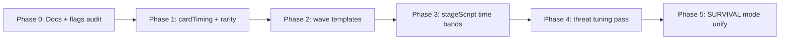

# Survival Mode — Overhaul Plan (Phase 2+)

Proposal based on [STATE_FLOW.md](./STATE_FLOW.md), [SPAWN_AUDIT.md](./SPAWN_AUDIT.md), and [BUFF_AUDIT.md](./BUFF_AUDIT.md).

**Goal:** Readable waves, fewer interruptions, stronger card moments, slower threat inflation — without rewriting ON_RAILS or Campaign in the same pass.

---

## Principles

1. **Teach one threat at a time** — max 3–4 enemy archetypes active per stage segment.
2. **Cards = milestones** — not every 12 seconds.
3. **Boss = punctuation** — warp + fight + clear reward, then breathing room.
4. **One source of truth for mode** — consolidate `NORMAL` vs `SURVIVAL` or document a single `SURVIVAL` path.

---

## 1. Progression redesign (wall-clock bands)

Map stages to **time + quota**, not quota alone.

| Phase | Time (survival) | Stage index | Enemies | Cards | Boss |
|-------|-----------------|-------------|---------|-------|------|
| **Intro** | 0–2 min | 1 | **1 type** (FAST or CHASER), slow spawn, ramp 8s | **None** (defer first card to 90s) | Mini elite or skip |
| **Learn** | 2–5 min | 2 | **2 types** (e.g. CHASER + RANGED) | First pick ~90s, then 45s interval | Optional mini-boss (half HP) |
| **Mix** | 5–8 min | 3 | **3 types** + **ELITE** intro | Normal cadence (see buff rework) | Real boss (full warp) |
| **Challenge** | 8–12 min | 4 | **4 types**, composed waves | Same | Full boss + post-boss EXCLUSIVE bias |
| **Endless** | 12+ min | 5+ | Rotating **templates** (4 types/wave) | Longer intervals | Boss every N minutes or quota |

### Implementation hooks (future)

- `src/game/balance/stageScript.ts` (new) — `getStageSegment(stage, survivalTime)` → `{ allowedPicks, spawnTemplateId, cardPolicy }`
- Gate `pickEnemyTypeForThreat` to segment allowlist instead of full threat pool
- Stage 1: `cardTimer = max(cardTimer, 90)` on run start

---

## 2. Wave composition rules

Replace pure random pick with **templates**.

### Template shape

```ts
interface WaveTemplate {
  id: string;
  picks: { type: EnemyType; weight: number }[]; // max 4 entries
  burst?: { atProgress: number; count: number; type: EnemyType };
  cadence: 'slow' | 'medium' | 'fast';
}
```

### Example templates

| Template | Composition | Feel |
|----------|-------------|------|
| `skirmish_fast` | 70% FAST, 30% CHASER | Learn dodging |
| `ranged_pressure` | 50% RANGED, 30% CHASER, 20% DASHER | Keep moving |
| `wall_phalanx` | 60% PHALANX, 40% RANGED | Control space |
| `swarm_burst` | 40% SWARM_V2, burst +8 at 50% progress | Spike moment |
| `elite_escort` | 50% CHASER, 30% ELITE, 20% SNIPER | Priority targets |

### Rules

- **Max 4 types** per template; stage picks 1–2 templates per segment
- **Weight stacks** — spawn same type repeatedly (`slotsLeft` weighting stays)
- **No threat unlock flood** — threat gates **templates**, not individual cases 0–20
- SWARM_V2 pack spawn only inside `swarm_*` templates

### Files to touch (Phase 2)

- `spawnComposition.ts` — `pickFromTemplate(state, template)`
- `App.tsx` — select template from stage script each stage start

---

## 3. Buff system rework

| Knob | Current | Proposed |
|------|---------|----------|
| Base interval | 20–24 s | **35–50 s** |
| Floor | 12 s | **28 s** |
| Passive discount | 0.8s each, max 8 | **0.4s**, max **4** |
| Stage discount | 1.2s/stage, max 6 | **0.6s**, max **3** |
| COMMON (normal) | 60% | **30%** |
| RARE | 25% | **30%** |
| EPIC | 10% | **22%** |
| LEGENDARY | 3% | **10%** |
| EXCLUSIVE | 2% | **5%** |
| Choices shown | 3 | **2** (faster pick, higher impact) |

### Pacing policy

| Event | Card behavior |
|-------|----------------|
| Run start | No card until **90s** OR first quota 50% |
| Stage clear | Guaranteed pick (keep) + **postBossBuffPick** |
| Boss kill | No extra picker if stage picker follows within 5s |
| Mystery door | **10%** (was 20%) |

### WOW moments

- Guarantee **EPIC+** on first card of stage 3+
- Visual + SFX tier by rarity on picker open (already partial via `exclusive` SFX)
- Show **synergy hint** when 2+ passives share tag (damage/fire)

### Files

- `cardTiming.ts` — new constants
- `pickBuffs.ts` — roll table + `count = 2`
- `App.tsx` — first-card gate, mystery rate

---

## 4. Threat scaling slowdown

| Parameter | Current | Proposed |
|-----------|---------|----------|
| `timeRamp` cap | +150% @ 600s | **+75%** @ 600s (`min(0.75, survivalTime/800)`) |
| `skillFactor` | `sqrt(score/3500 + 1)` | **`cbrt(score/3500 + 1)`** or cap at 2.0 |
| `getThreatMult` max | 2.25 | **1.75** |
| Threat from passives | +2 per passive | **+1.5**, cap 100 unchanged |
| `maxEnemies` late cap | 50 desktop | **38** — reduce clutter |
| Spawn chance cap | 0.85 | **0.55** |

Keeps run harder over time without invalidating dodge skill.

---

## 5. State flow fixes (engineering)

Do alongside design — small, high-value.

| Fix | Priority |
|-----|----------|
| Unify `gameMode`: menu sets `SURVIVAL` or all gates use `!== ON_RAILS` | P0 |
| Don't tick `cardTimer` while `bossArenaTransition > 0` or `isPaused` | P1 |
| Single `bossActive` assignment at end of warp only | P2 |
| Assert `mainWorldSnapshot` before restore; log in dev | P1 |
| Document `stageTransition` units; consider seconds for clarity | P2 |

---

## 6. Suggested implementation order



| Phase | Deliverable | Test |
|-------|-------------|------|
| **0** | These docs + align team | — |
| **1** | Buff interval + rarity + 2 choices | 10 min run: ≤4 cards |
| **2** | 5 templates, stage 1–2 forced | Only 1–2 enemy silhouettes early |
| **3** | Time bands + no cards 0–90s | First 2 min calm |
| **4** | HP/damage curves | TTK stable stage 1→4 |
| **5** | Mode enum cleanup | One survival path in QA matrix |

---

## 7. Success metrics (playtest)

| Metric | Target |
|--------|--------|
| Cards per 10 min | ≤ 8 (was ~25–40) |
| Distinct enemy types visible at 2 min | ≤ 2 |
| First EXCLUSIVE | avg stage 3+, feels earned |
| Boss warp → kill → next stage | < 30s downtime, no double-pause |
| Player survey "I knew what killed me" | ↑ vs baseline |

---

## 8. Out of scope (Phase 2)

- ON_RAILS wave/boss changes (separate docs in `onRails/`)
- Campaign portal / level JSON rework
- New enemy types (case 21+)
- Multiplayer / meta scrap economy

---

## Reference bible index

| Doc | Use when |
|-----|----------|
| [STATE_FLOW.md](./STATE_FLOW.md) | Boss flags, warp, stage transition bugs |
| [SPAWN_AUDIT.md](./SPAWN_AUDIT.md) | Case 0–20 stats, caps, spawn math |
| [BUFF_AUDIT.md](./BUFF_AUDIT.md) | Rarity, timing, buff list |
| **This file** | Phase 2+ prioritization and target numbers |
